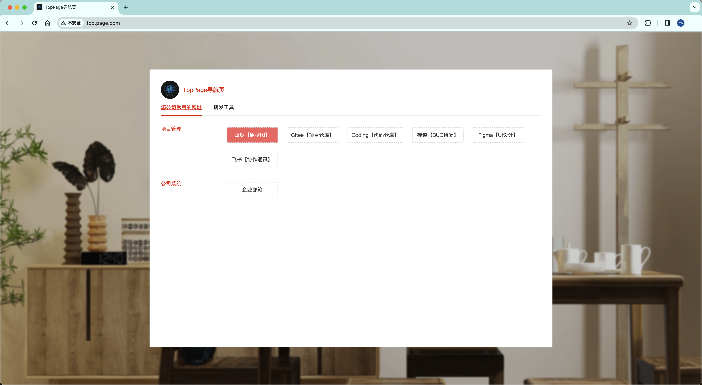
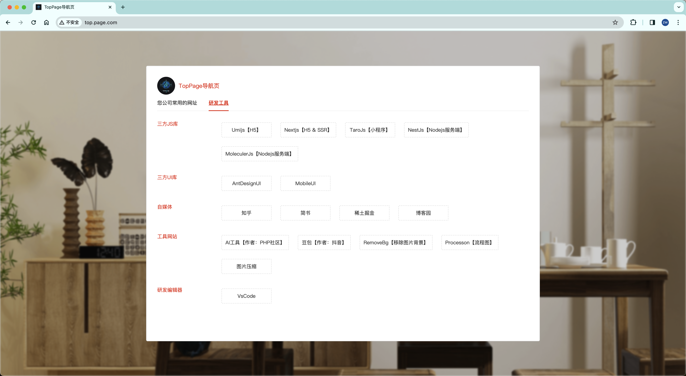

# TopPage
> 简介：TopPage是一个本地部署的快速跳转解决方案，旨在简化用户在本地环境中快速导航到您所需要的资源的过程。提高工作效率，节省时间。

## 安装

### 项目配置：

```shell
# 安装依赖
> pnpm install

# 编译dist目录 
> pnpm run build
```

### 部署配置：

> nginx文件配置

```shell
# 编辑nginx/nginx.conf，替换“您本地的项目路径”
# 安装nginx教程请自己查找，mac通常是brew install nginx

# 查看您的nginx配置路径，并添加一段include，如：`include /您本地的项目路径/nginx/nginx.conf;`
> nginx -t

# 然后重新启动nginx
> nginx -s reload
```

> host文件配置

```shell
> sudo vi /etc/host
# 添加一段域名映射
# 127.0.0.1    top.page.com
```

配置完成后可以访问：http://top.page.com/

### 内容配置：

> 数据文件配置

```txt
项目中有个文件：data/data.json
```

### 项目预览图片：




